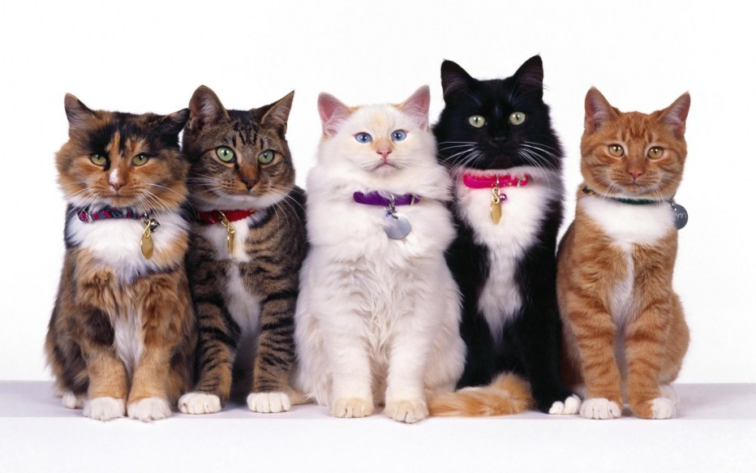
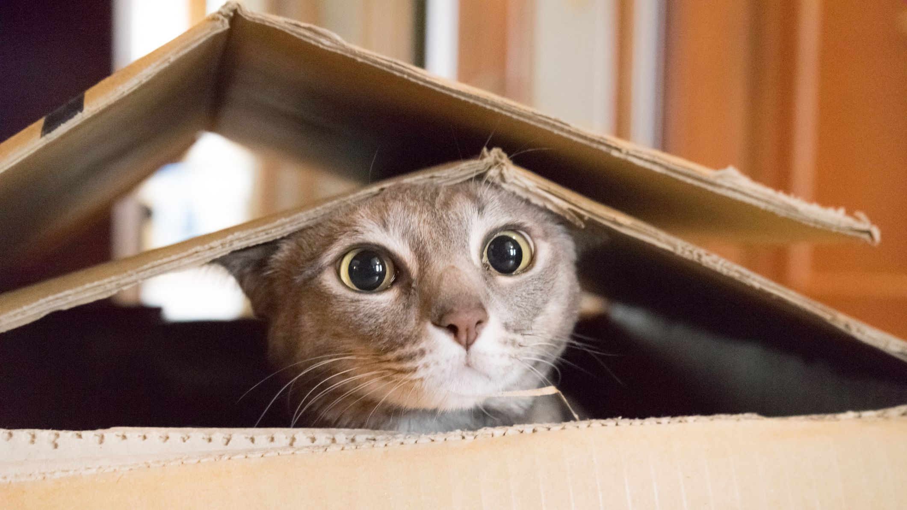

# Find your favorite cats

This is study pet project, where i repeated some had learned moments earlier and  tryed to figure out in new libraries ...

picture ?
___
<a id='suda'></a>
## Description

In this project you can find a lot of cats differetn breeds, read information about it, and create your favorite collection ...
___
### -------------- picture from https://shields.io/ ?
___
### -------------- demo ?
___

### Technologyes that i used in this project:
```
 * styled-components & styled-system
 MUI ?
 tailwind ?

 * react-image-gallery
 * react-select
 * react-rating-stars-component

 * date-fns
 * axios
 * react-hook-form
 * react-router-dom
 * own hooks

 * react-redux
 * redux-toolkit
 * redux-persist
    
 * prop-types
 TS ?
  ``` 
     
   
#### Try other stuff here:)
__Жирный__
_Курсивный_

    ___Все как есть (4 пробела)___

сноска первая[^1] , вторая[^2]
[^1]: текст первой сноски
[^2]: текст второй сноски


>Цитата
>>Вложеная цитата

[ссылка куда-либо](https:...)




[](http://localhost:3000/)


Таблица вот так:
Кот | Количество | Вес
:---|:----------:|-----:
Британец | 1 | 5кг
Перс | 2 | 3кг
Сиамский | 3 | 4кг

\# "Экранирование" специальных символов (через слэш) - в данном примере это решетка

Термин
: Определение


[Так делается переход по странице, для наглядного руководства (вверху тег а - с id)](#suda)


